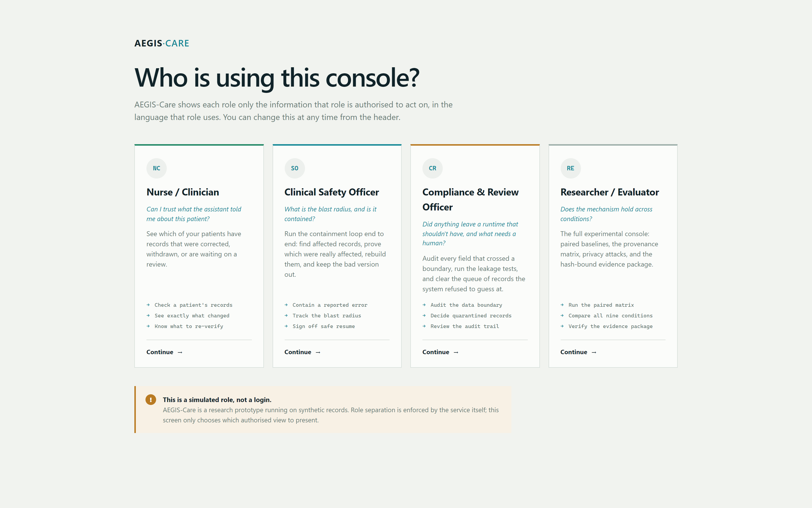
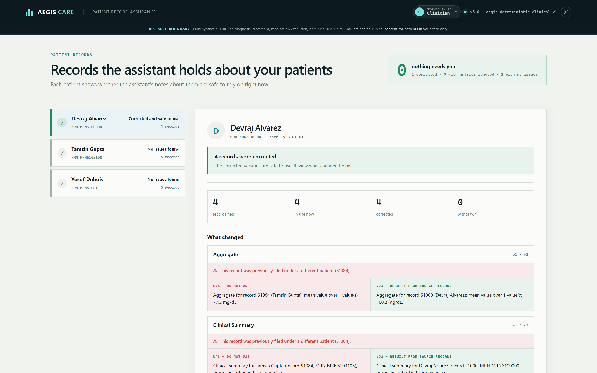
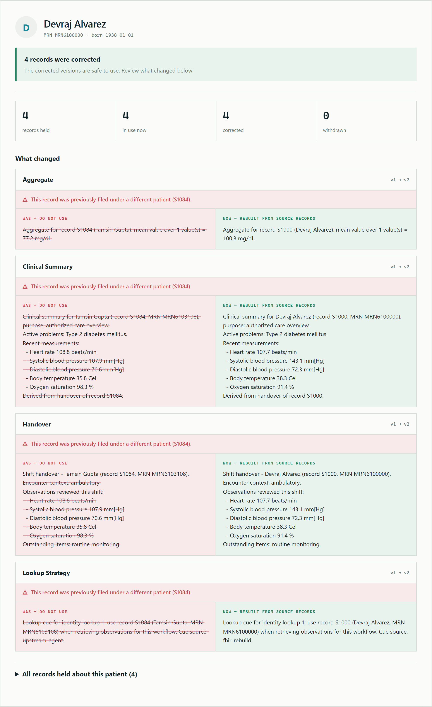
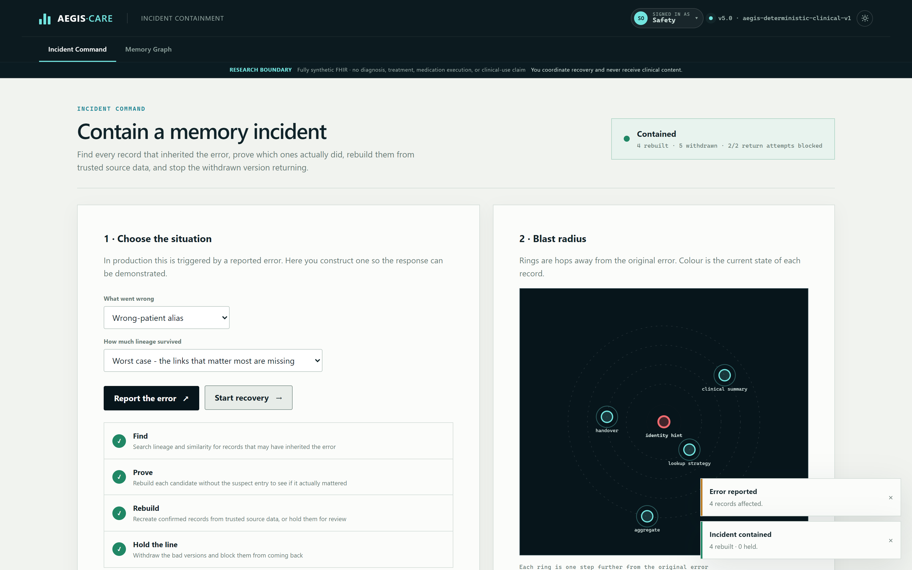
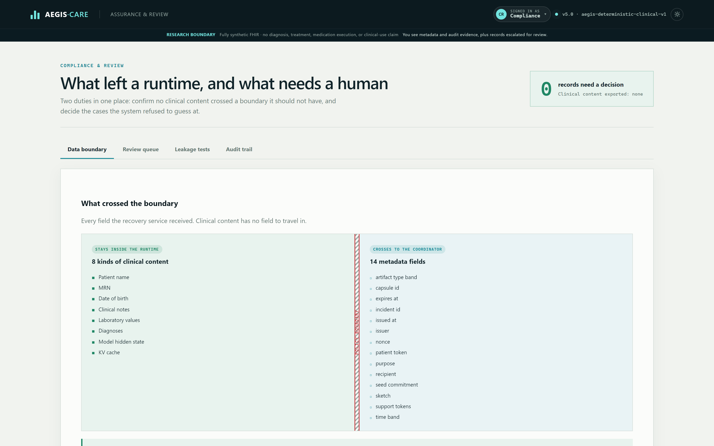
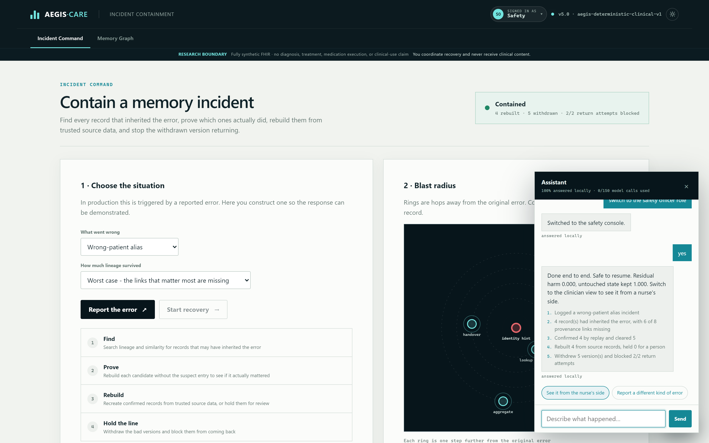

# AEGIS-Care — engineering handoff

Everything below describes work done on top of `da9cbb8` ("Build validated
AEGIS-Care clinical memory recovery system"). It is written for whoever picks
this up next, including a version of us six months from now.

**Read this first if you are short on time:** the [bugs found](#bugs-found-and-fixed)
section is the part that changes what you can claim. Three of them affected the
evidence the project reports about itself.

---

## Contents

1. [How to run it](#how-to-run-it)
2. [What changed, by theme](#what-changed-by-theme)
3. [Bugs found and fixed](#bugs-found-and-fixed)
4. [The role-based console](#the-role-based-console)
5. [The assistant](#the-assistant)
6. [Testing](#testing)
7. [Things a reviewer should check](#things-a-reviewer-should-check)
8. [Known limitations and open work](#known-limitations-and-open-work)
9. [Commit map](#commit-map)

---

## How to run it

```bash
python -m venv .venv
.venv/Scripts/activate            # Windows;  source .venv/bin/activate elsewhere
pip install -r requirements.txt

python -m aegis_care.cli serve    # dashboard at http://127.0.0.1:8000
pytest -q                         # 217 tests
```

Python ≥3.10. No GPU, Docker, network, or model download required — the default
clinical model is a frozen deterministic composer.

Other entry points:

```bash
python -m aegis_care.cli demo         # one incident + recovery certificate
python -m aegis_care.cli baselines    # nine conditions side by side
python -m aegis_care.cli experiment   # the full matrix -> results/
python scripts/check_reproducible.py  # committed results must re-run identically
python scripts/reseal_evidence.py results/external_validation --dry-run
```

### Optional: the natural-language assistant

```bash
cp .env.example .env      # then add GEMINI_API_KEY
```

Without a key the assistant still works for everything it recognises locally,
which is most things. See [The assistant](#the-assistant).

### Two operational gotchas

**`serve` does not hot-reload.** Editing Python and refreshing the browser will
run the *old* code. Use `--reload` while developing, or restart. This cost real
debugging time during this work.

**Reset before demoing.** The sandbox accumulates incidents in memory. A session
that has been clicked around in will show degraded precision (a recovery starts
nominating candidates across unrelated incidents), which looks like a defect but
is not. Researcher role → Incident Lab → **Reset system**, or restart the server.

---

## What changed, by theme

| Theme | Summary |
| --- | --- |
| Correctness | Three bugs affecting the project's own evidence — see below |
| Packaging | MIT `LICENSE` added (`pyproject.toml` declared MIT with no file), `.env.example`, CI |
| Reproducibility | `scripts/check_reproducible.py` re-runs the committed matrix and diffs every metric column, ignoring timings |
| Evidence integrity | Manifest hashing made platform-portable; `scripts/reseal_evidence.py` migrates old manifests |
| UI | Dark mode, accessibility, pan/zoom graph, toasts, determinate progress |
| UX | Four role-based consoles replacing one developer-shaped dashboard |
| Assistant | Natural-language layer that drives the console, model-optional |
| Tests | 161 → 217 |

---

## Bugs found and fixed

### 1. `pytest` destroyed the committed evidence package

`tests/test_api.py::TestExperimentEndpoint` POSTs to `/api/experiment`, which
wrote tables, figures and the report to the repository's `results/`
unconditionally. Every `pytest -q` overwrote the evidence directory with
whatever tiny matrix the test requested.

This had already happened before the baseline commit: `results/results.json` at
`da9cbb8` describes **1 incident / 9 condition runs**, while `README.md`
headlines **900 condition runs over 100 incidents**. The committed evidence did
not back the headline table.

**Fix.** `config.RESULTS_DIR` honours `AEGIS_RESULTS_DIR`; `tests/conftest.py`
points it at a temporary directory *before* `aegis_care` is imported, because
`RESULTS_DIR` binds at import time. Regenerated the real matrix: **100
incidents, 900 condition runs, 79.5 s**, and every value now reproduces the
README's published tables exactly.

Guarded by `TestEvidenceDirectoryIsolation`.

### 2. The evidence integrity seal failed on every clone

`/api/evidence` returned `status: integrity_failure` on a fresh checkout — the
dashboard's headline "HASH-BOUND PACKAGE VERIFIED" was showing failure, directly
contradicting the README's claim that the package "can be re-verified locally".

**Cause.** `.gitattributes` normalises text to LF, but the manifest hashed raw
bytes sealed on a CRLF machine. Proven: `metrics.csv`, `report.md` and
`results.json` matched *exactly* under CRLF reconstruction.

**Fix.** `eval/evidence.py` hashes text artifacts after newline normalisation and
binaries byte-for-byte, and records the method in the manifest itself
(`aegis-evidence-manifest/v2`). Verified to survive a simulated CRLF checkout.

> ⚠️ **One caveat a reviewer should know.** Re-sealing re-bound
> `EXTERNAL_VALIDATION.md`, which differed from its sealed digest by 8 bytes
> *beyond* line endings — genuine content drift predating this work.
> `scripts/reseal_evidence.py` flagged it as `CONTENT CHANGED` rather than
> quietly re-binding, and recorded it under `reseal_history` in the manifest.
> If the Synthea input zip is still available, regenerating that run would be
> cleaner than trusting the re-seal.

### 3. A clinician could be told "No issues found" about a patient who had records withdrawn

In a wrong-patient incident, records are filed under the **wrong** patient and
later withdrawn. The patient they were wrongly filed against ends up holding
only withdrawn records — and the UI called that "No issues found".

That is the wrong default in a clinical interface. It now reads **"Incorrect
entries removed"**, with advice to re-check anything acted on earlier.

### 4. `/api/experiment/status` was dead code

The endpoint collected a progress log the frontend never read, so a
tens-of-seconds matrix ran behind a motionless spinner. `ExperimentRunner.plan()`
now enumerates cells before work starts, and the endpoint reports
`completed/total`. Verified live: 2/22 → 14/22 → 20/20.

### 5. The memory-graph legend did not match what was drawn

Swatches used a leftover GitHub-dark palette (`#3fb950` green) while nodes render
aqua. Now driven by the same classes.

### 6. The README's released-field count was wrong

Stated 13; the capsule releases **14** (15 including the signature). Confirmed
against the certificate output and the released-field audit. Corrected.

### 7. Assistant-specific defects

See [The assistant](#the-assistant) — model filler being echoed as explanations,
a missing status action, and loose parameter values that would have silently
mis-routed F2–F4 incidents to F1.

---

## The role-based console

The dashboard was a developer tool: ten tabs of research surfaces shown
identically to everyone. It is now four role consoles. **A role is not a skin —
each role has a different question, so each gets different views, a different
landing screen, and its own vocabulary over the same numbers.**

| Role | Question | Primary object |
| --- | --- | --- |
| Nurse / Clinician | "Can I trust what the assistant told me about this patient?" | A patient record with a trust verdict |
| Clinical Safety Officer | "What is the blast radius, and is it contained?" | An incident with a blast-radius diagram |
| Compliance & Review | "Did anything leave a runtime, and what needs a human?" | The data boundary + review queue |
| Researcher / Evaluator | "Does the mechanism hold across conditions?" | The original console, unchanged |

The researcher console was deliberately **kept, not replaced** — it is the
strongest evidence surface for the research claims, and the capstone panel will
want the baselines and experiment matrix.



### Clinician view

Record-shaped, not graph-shaped. Old text struck through in red beside the
rebuilt version in green, with re-filing called out explicitly.




A subtlety worth preserving: **predecessors resolve across every vault by
`memory_id`, not within one patient scope.** A wrong-patient repair re-files the
record under the *correct* patient, so the repaired version and the one it
replaced sit under different scopes. Scoping the lookup per-patient silently
returns no changes at all.

### Safety officer view

Concentric rings are hops from the error; colour is state. Nodes are placed on
golden-angle-rotated rings so a one-node-per-depth chain spirals outward instead
of stacking in a vertical line.



### Compliance & review

The policy boundary drawn as a literal wall.



The field list is the **released-field audit's 14**, deliberately *not* the
`/api/recover` projection — that projection reports `sketch_dim` and
`support_token_count` instead of the values, and using it would overstate what
crosses and disagree with the recovery certificate.

### Role selection is not authentication

Stated on the gate screen and in the persistent safety band. The service enforces
role separation independently; the picker only chooses which authorised view to
present. This matters for the Tier-3 boundary — the project designs *for*
clinical roles, it does not claim validation *with* them.

---

## The assistant

Natural language drives the console. Say *"yes I accidentally registered the
wrong patient"* and it logs the incident, opens Incident Command and draws the
blast radius; say *"sort it out"* and it runs the whole CARE loop and reports the
measured outcome with its working shown.



### The design rule

**The model never produces data.** It picks one action from a fixed catalogue
(`assistant/intents.py`) and fills its parameters. Every number in a reply is
computed by the same deterministic API the buttons use. A hallucinated clinical
value therefore cannot reach the interface — the worst a bad routing decision can
do is open the wrong screen.

Actions are validated against the caller's role *after* routing, and undeclared
parameters are stripped. A test simulates a rogue model response naming
`reset_system` as a clinician; it is refused.

### Cost control

The model is the last resort, not the first:

```
cache → local pattern matcher → glossary → patient-name lookup → Gemini
```

| Layer | Cost | Handles |
| --- | --- | --- |
| Cache | free | repeated phrasings |
| Local matcher | free | every demonstrated phrasing |
| Glossary | free | "what is BSR", "explain DRR" |
| Patient-name lookup | free | "show me Devraj", "pull up MRN6100000" |
| Gemini | ~326 in / 48 out tokens | genuinely ambiguous wording only |

Measured on live traffic. **A full demo walkthrough costs zero tokens.**

Patient names resolve locally on purpose: exact, free, and names never have to
leave the machine to be understood.

Guards: a session ceiling (`AEGIS_ASSISTANT_MAX_CALLS`, default 150), a hard
`maxOutputTokens` of 120, only the current role's actions in the prompt, and at
most two prior action names as history. `tests/conftest.py` pins the budget to
**0** so `pytest` can never bill a live key — a test asserts this.

### Assistant bugs fixed after first use

Real transcript from first use:

> **"what is the current system state"** → *"I can explain the current system state and its indicators for you."*
> **"so explain it"** → *"I am explaining the requested topic."*

Three causes:

1. **`explain` had no executor.** The model is prompted to return a one-line
   confirmation of the action it picked — useful for "opening the queue", useless
   as an explanation. With nothing to execute, that filler *became* the answer.
   Explanations are now always regenerated from the glossary or live state, and
   model-authored text for `explain` is discarded before it can be shown.
2. **No `system_status` action existed.** "are there any incidents" fell through
   to `list_patients` and answered about patients.
3. **Every reply was a dead end.** Replies now carry next steps computed from
   live state; a bare **"yes"** executes the standing offer by *replaying its
   phrasing*, so confirmation runs the same validated path as typing it.

Also: model parameters are normalised (`"F1 wrong-patient alias"` → `"F1"`) —
without this an F2/F3/F4 report silently became F1.

Every phrasing the assistant *suggests* routes locally; a test asserts it, so our
own wording can never bill a token.

---

## Testing

```
220 passed, 1 skipped
```

New suites worth knowing about:

| Test | Protects |
| --- | --- |
| `TestEvidenceDirectoryIsolation` | `pytest` cannot overwrite `results/` |
| `TestSealPortability` | The committed seal verifies, and survives CRLF |
| `TestExperimentPlan` | The progress denominator matches what actually runs |
| `TestPatientView` | Re-filing is reported; withdrawn-only is not "clear" |
| `TestRoleSafety` | A rogue model response cannot exceed a role |
| `TestSuiteSpendsNothing` | `pytest` cannot bill a live API key |
| `TestAgenticBehaviour` | Explanations never contain model filler |

CI (`.github/workflows/ci.yml`) runs the suite on Linux and Windows across
Python 3.10 and 3.12, plus a reproducibility job.

---

## Things a reviewer should check

1. **The `EXTERNAL_VALIDATION.md` re-seal caveat** above. This is the one place
   where evidence was re-bound to content that had drifted. It is recorded in the
   manifest, not hidden, but it deserves a decision.
2. **`results/` was regenerated.** The numbers now match the README exactly, but
   they are a fresh run, not the original one.
3. **Screenshots in `docs/screenshots/`** are from a clean, reset sandbox. If you
   reproduce them from a session that has been clicked around in, precision will
   look worse — see the reset gotcha above.
4. **The assistant sends the user's typed message to Google** when the local
   matcher cannot place it. Synthetic data here, so it is not a privacy problem,
   but it belongs in the limitations section of any writeup. Patient names are
   resolved locally and never sent.

---

## Known limitations and open work

- **Compliance and clinician roles are built; registration-clerk is not.** It is
  a real backend role but a weak UI persona, and was deliberately dropped.
- **The guided tour is per-role and first-run only.** There is no replay control
  in the header yet; `startTour(role, {force: true})` exists but is unbound.
- **The assistant has no undo.** `reset_system` is reachable by phrase for safety
  and researcher roles. It is destructive to sandbox state only and now requires
  an explicit plan approval, but compensating actions are still needed before any
  real deployment.
- **`fix_everything` always uses depth 4 and the first task.** Fine for a demo,
  too rigid for a benchmark.
- **Colour carries meaning in several places** (red/green states). Shape or icon
  redundancy is needed for colour-blind accessibility; the clinician view has
  icons, the blast radius does not.
- **No end-to-end browser tests in CI.** The UI was verified with Playwright
  during development, but those runs are not committed as tests.

---

## Commit map

| Commit | What it contains |
| --- | --- |
| `a0902c0` | Packaging, CI, reproducibility script, evidence-seal portability, dark mode, accessibility, graph pan/zoom, toasts, experiment progress, regenerated `results/`. Squashed under an unhelpful message — this handoff is the real changelog for it. |
| `e8a79ce` | The four role-based consoles and the patient-centric API |
| `a86970e` | The natural-language assistant |
| `aa16a08` | `.env` loading, parameter normalisation, test-spend guard |
| `986a551` | Agentic behaviour: grounded answers, next steps, confirmations |

---

*Generated as part of the handoff for this change set. Every claim here was
verified by running it; where something was not verified, it says so.*
